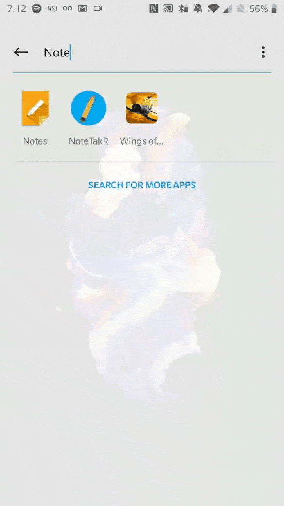

# Mobile-Devices CSCI4100U Final-Project (NoteTakR)

## NoteTakR 

Note Taking app designed to be minilmalist to quickly take notes and save them in a local sqflite database. 

## How to run
With flutter installed and an android device connected, run `flutter run` in the notetakr folder.

## Group members
- Nandor Gallo
- Leonard Zbona
- Mohammad Mushfequr Rahman
- Daniel Bullock

## Objective Requirements
- **Multiple screens/navigation** (App allows various screens, for example the drawer selections) 
- **Dialogs and pickers** (Adding a new class for notes, adding assignments)
- **Snackbars and notifications** (Snackbars for adding class/assignment, notifications for due dates - Notifications.dart, LecturePage.dart)
- **Local storage** (Assignments and courses saved locally - models folder)
- **Cloud storage** (Daily polls stores votes in firebase - TodaysPolls.dart)
- **Data tables and charts** DataTables to display assignments and due date,chart to display the frequency of due dates. Assignment db must be populated inorder to display the charts. (AssignmentsChartsPage.dart)
- **Maps** (Campus Map screen - map.dart)
- **Geolocation** (Gets current lat/long using geolocator - map.dart)
- **Geocoding** (Gets current address from current lat/long - map.dart)
- **i18n** (App has french, russian, italian, and spanish versions from lang/*.json - app_localizations.dart)
 
## Other features
- http request (Offered courses pulls from ontario tech available courses json)
- flutter speech to text (Transcribe Notes)
- flutter slidable (Slidable menu)
- pull to refresh (unique loading menus)
- flare splash screen (loading animation)

## FAQs 

- Why won't recording notes work? 
        
        1. Make sure the app has permission for microphone 

        2. The flutter package does not work with the emulator so you may need to use a physical device to test the microphone. The gif shows a test run on a one plus 5 device. 
    
